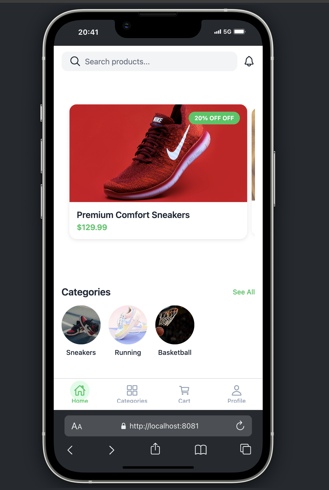
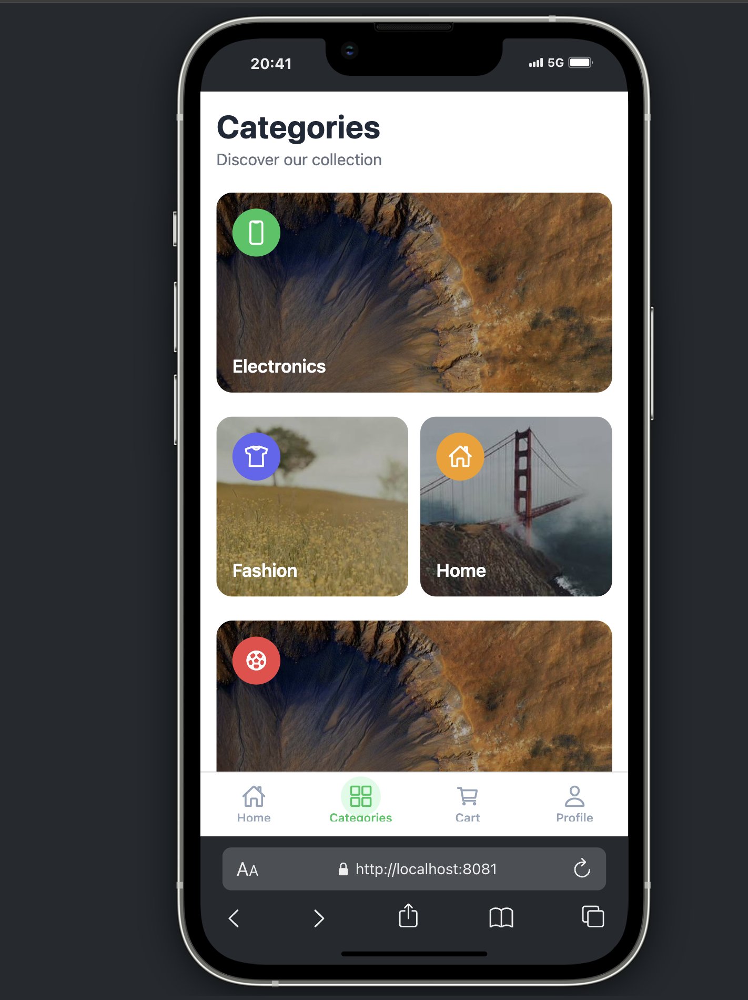
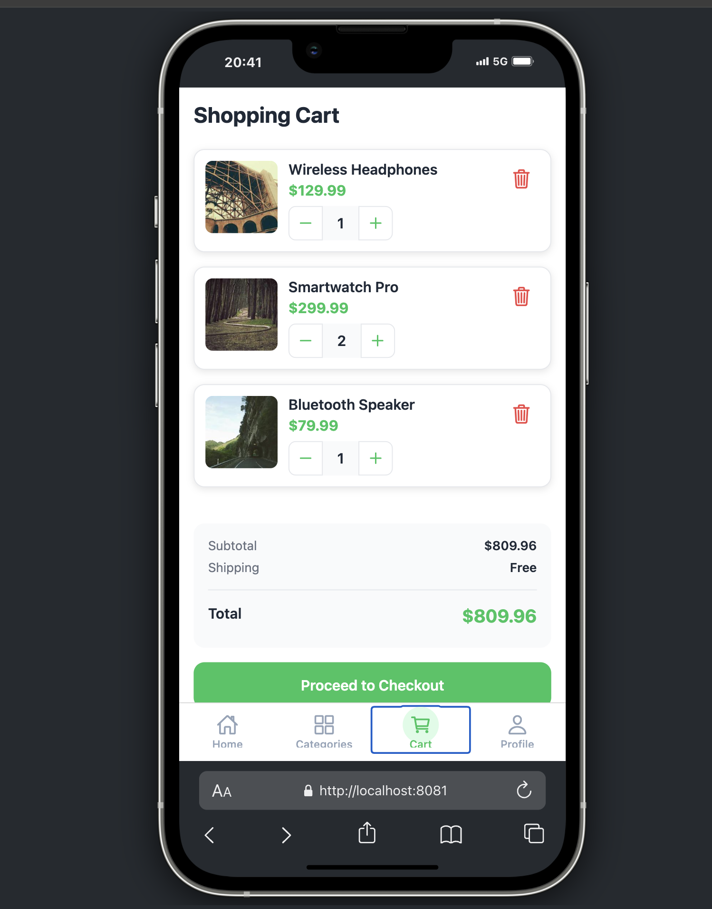
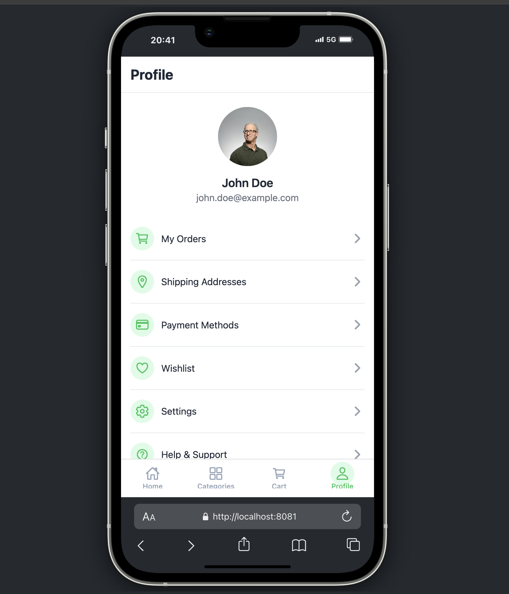
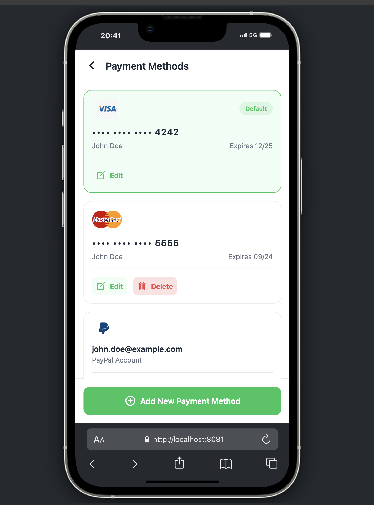
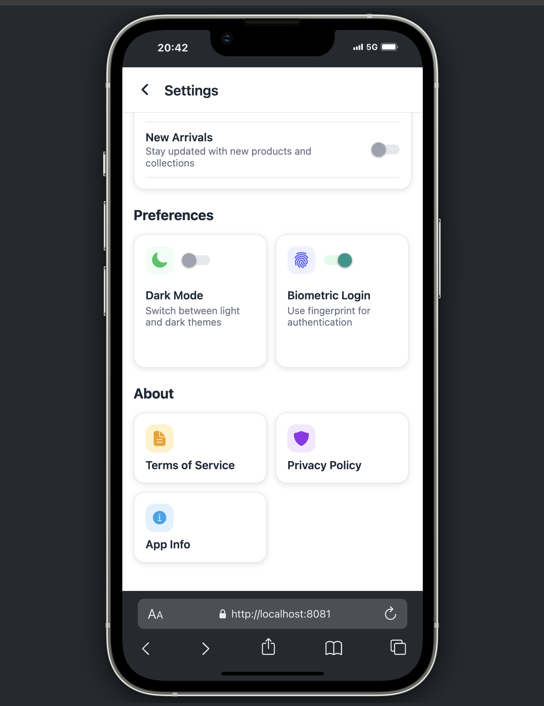

# 🛍️ React Native E-Commerce App

A modern, fully-featured e-commerce application built with React Native and Expo Router. This app demonstrates best practices in mobile and web development, featuring a modular architecture, smooth navigation, and a beautiful UI/UX design.


## ✨ Features

- 📱 Modern Tab Navigation
- 🎯 Component-Based Architecture
- 🎨 Clean and Minimalist Design
- 🔄 Smooth Transitions and Animations
- 📦 Modular and Reusable Components
- 🛠️ TypeScript for Type Safety
- 🌐 Cross-Platform (iOS, Android & Web)
- 💻 Responsive Web Design

## 🏗️ Built With

- [React Native](https://reactnative.dev/) - A framework for building native apps using React
- [Expo](https://expo.dev/) - A framework and platform for universal React applications
- [Expo Router](https://docs.expo.dev/routing/introduction/) - File-based routing for Expo apps
- [TypeScript](https://www.typescriptlang.org/) - Typed JavaScript at any scale
- [React Native Safe Area Context](https://github.com/th3rdwave/react-native-safe-area-context) - A flexible way to handle safe area insets
- [Ionicons](https://ionic.io/ionicons) - Premium icons for web, iOS, and Android applications

## 📱 App Structure

```
app/
├── (tabs)/                   # Tab navigation
│   ├── _layout.tsx          # Tab layout configuration
│   ├── index.tsx            # Home screen
│   ├── cart.tsx             # Cart screen
│   ├── categories.tsx       # Categories screen
│   └── profile.tsx          # Profile screen
│
├── (modals)/                # Modal screens
│   ├── orders.tsx           # Orders modal
│   ├── shipping.tsx         # Shipping addresses modal
│   ├── payment.tsx          # Payment methods modal
│   ├── wishlist.tsx         # Wishlist modal
│   ├── settings.tsx         # Settings modal
│   └── support.tsx          # Support modal
│
├── components/              # Reusable components
│   ├── home/               # Home screen components
│   ├── navigation/         # Navigation components
│   └── screens/            # Screen-specific components
│
├── constants/              # Constants and theme
├── hooks/                  # Custom hooks
├── services/              # API services
├── types/                 # TypeScript types
└── utils/                 # Utility functions
```

## 🚀 Getting Started

### Prerequisites

- Node.js (v14 or newer)
- npm or yarn
- Expo CLI
- iOS Simulator (Mac only) or Android Studio

### Installation

1. Clone the repository
   ```bash
   git clone https://github.com/hamzaince6/react-native-epo.git
   ```

2. Install dependencies
   ```bash
   cd react-native-epo
   npm install
   # or
   yarn install
   ```

3. Start the development server

   For Mobile:
   ```bash
   npx expo start
   ```
   - Press `i` for iOS simulator
   - Press `a` for Android emulator
   - Press `w` for open web
   - Or scan the QR code with Expo Go app on your device

   For Web:
   ```bash
   npm run web
   # or
   npm run dev
   ```
   Then open http://localhost:8081 in your browser

## 📱 Platform Support

### Mobile
- Native iOS app
- Native Android app
- Smooth animations and gestures
- Platform-specific optimizations

### Web
- Responsive design
- Desktop and mobile browser support
- Progressive Web App (PWA) capabilities
- Optimized for different screen sizes

## 💻 Web Development

### Development Commands

```bash

# Start development server for all platforms
npm run dev

# Build for web production
npm run build

# Preview production build
npm run preview
```

### Web Features

- 🖥️ Responsive Layout
  - Mobile-first design
  - Tablet and desktop optimizations
  - Adaptive grid layouts

- ⚡ Performance
  - Code splitting
  - Lazy loading
  - Image optimization
  - Fast page loads

- 🎨 UI/UX
  - Hover effects
  - Desktop-specific interactions
  - Keyboard navigation
  - Accessibility support

- 🛠️ Development
  - Hot Module Replacement (HMR)
  - Development server with live reload
  - Source maps for debugging
  - TypeScript support

### Browser Support

- Chrome (latest)
- Firefox (latest)
- Safari (latest)
- Edge (latest)
- Mobile browsers

## 📸 App Screenshots

|  |  |
|:-------------------------:|:-------------------------:|
|  |  |
|  |  |

## 🎯 Key Features

### Home Screen
- Featured product carousel
- Categories grid
- Flash deals section
- Popular products
- New arrivals
- Special offers

### Categories
- Grid layout
- Category filtering
- Product sorting

### Cart
- Product quantity adjustment
- Price calculation
- Checkout process

### Profile
- User information
- Order history
- Shipping addresses
- Payment methods
- Settings
- Support

## 🤝 Contributing

Contributions are welcome! Please feel free to submit a Pull Request.

1. Fork the project
2. Create your feature branch (`git checkout -b feature/AmazingFeature`)
3. Commit your changes (`git commit -m 'Add some AmazingFeature'`)
4. Push to the branch (`git push origin feature/AmazingFeature`)
5. Open a Pull Request

## 📝 License

This project is licensed under the MIT License - see the [LICENSE](LICENSE) file for details.

## 👏 Acknowledgments

- [Expo Team](https://expo.dev/) for the amazing framework
- [React Native Community](https://reactnative.dev/community/overview) for the support
- [Ionicons](https://ionic.io/ionicons) for the beautiful icons

Project Link: [https://github.com/hamzaince6/react-native-epo](https://github.com/hamzaince6/react-native-epo)
